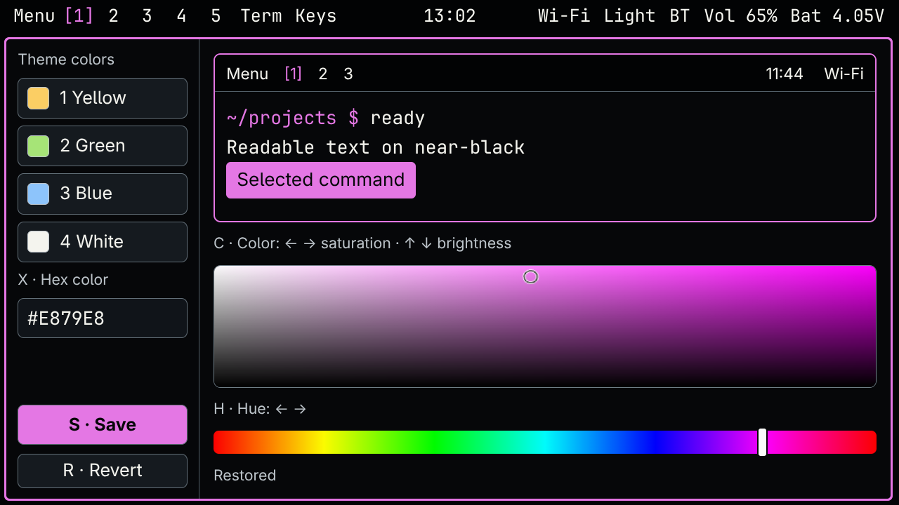
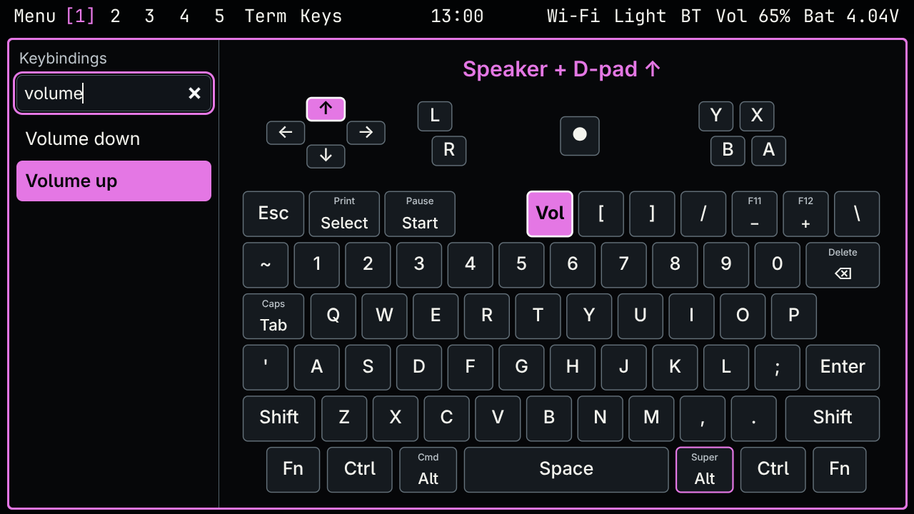
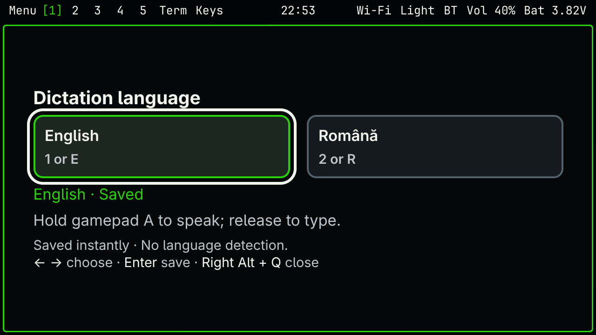
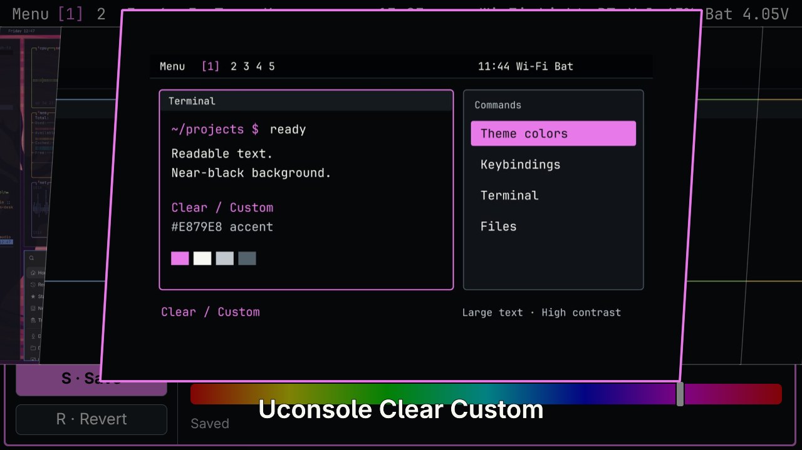

# uConsole Clear

A readable, near-black Omarchy theme and keyboard toolkit for the ClockworkPi uConsole. Large text, solid contrast, a physical keyboard guide, and an accent editor that works without the trackball.

Verified on a CM5 uConsole running the ARM64 Omarchy 4 Pi RC1 build, Omarchy 4.0.2, Hyprland 0.56.1 and Quickshell 0.3.1. This uses Omarchy's **Lua / Quickshell generation**, not the older Hyprland `.conf` / Waybar setup. CM4 and other releases have not been hardware-tested here.



## Install

Already running the supported Omarchy desktop:

```bash
git clone https://github.com/cosmindolha/omarchy-uconsole-clear-theme.git
cd omarchy-uconsole-clear-theme
./install.sh --check
./install.sh
```

Run as the desktop user, including over SSH after the graphical session has started. Dependencies include Python 3.11+, librsvg (`rsvg-convert`), libxkbcommon tools, brightnessctl, and the standard Omarchy desktop commands. The user must belong to `video`.

The installer applies monitor rotation/scale, readable fonts, full-width scrolling columns, the text bar, keyboard bindings, and the editor. It saves the previous Hyprland/theme configuration under `~/.local/state/uconsole-before-clear` and keyboard configuration under `~/.local/state/uconsole-before-keyboard`. It installs one root udev rule for backlight access. It replaces the user shell/bar and monitor layout; review the scripts if you have existing customizations. A rerun retains an already-selected Clear accent.

For the **base yellow theme alone**, use Omarchy's Install → Style → Theme with this repository URL. That does not install the keyboard utilities or change display scaling. For the OS installation itself, see [the CM5 SSH installation guide](https://github.com/cosmindolha/omarchy-uconsole-cm5).

## Controls

- **Either Alt + Space:** Omarchy menu. Style → Theme colors opens the editor.
- **Left Alt + Enter:** terminal. **Left Alt + K:** physical keyboard guide.
- **Left Alt + T:** Activity / btop, fullscreen at 13 pt with zero terminal padding (98×24 cells on the tested screen). All four panels fit; Q closes it. Normal terminal fonts remain unchanged.
- **Right Alt + Q:** close the focused app. Left Alt + Q also works.
- **Either Alt + Shift + K:** complete searchable shortcut list.
- **Left Alt + Tab:** next app. **Right Alt + Tab:** next workspace.
- **Hold speaker + D-pad Up / Down:** volume changes in 5% steps; holding repeats. **Fn + speaker:** mute.
- **Fn + comma / period:** one actual backlight level down/up. **Fn + Space:** keyboard lighting.
- **Either Alt + L:** manual lock. Automatic locking is delayed to one hour; display blanking follows the lock.

Right Alt becomes Super on the onboard keyboard. The speaker key becomes a held modifier on its separate consumer-control interface. The other keyboards retain their mappings. Left Alt alternatives can override an application's own Alt shortcuts. Game-button behavior is retained; with optional Voxtype installed, gamepad A also controls dictation.

The consumer-control device uses `resolve_binds_by_sym = true` so Hyprland matches its remapped modifier symbol. Without this, the original volume-down keycode can still trigger the stock repeating binding when the speaker key is held alone. See [Hyprland's symbol matching documentation](https://wiki.hypr.land/configuring/core/binds/keyboard-layouts/).



The guide lists commands on the left and highlights the physical keys on the right. Normal keys are square. It prefers a modifier on the opposite side of the action key where possible, including Ctrl. Start typing to search immediately; the Find command field receives focus when the guide opens or regains focus. Typing after browsing commands also returns to search. Use Up/Down to browse and Esc to clear, or click a physical key to filter.

## Optional voice dictation

Run `./scripts/install-voxtype.sh` as the desktop user to install the checksum-verified official [Voxtype 1.0.1 ARM64 CPU build](https://github.com/peteonrails/voxtype/releases/tag/v1.0.1), download the multilingual Whisper base model, and enable the user service. New configurations use automatic language detection and four CPU threads; existing configurations are retained. This is optional and is not part of the theme installer.

Connect a USB microphone and select it as the default audio input. **Hold gamepad A** while speaking, then release it to transcribe and type into the focused text field. **Left Alt + D** remains a toggle alternative. The gamepad listener requires `python-evdev` and read access to the onboard gamepad (the tested user belongs to `input`). It recognizes the stock 20230713 firmware button code 289, independent of the ordinary typing A key, and reconnects after USB reattachment. The physical keyboard guide includes this shortcut. Speech recognition runs locally. Check `voxtype status`, `voxtype info devices`, and `journalctl --user -u voxtype` for diagnostics. A speaker-output monitor is not a microphone.

### Faster-whisper with English/Romanian settings (recommended on CM5)

After installing Voxtype, run `./scripts/install-faster-whisper.sh`. This installs a checksum-verified ARM64 uv runtime, isolated Python 3.12 environment, pinned faster-whisper/CTranslate2 dependencies, and the pinned multilingual base model. It keeps the model loaded on the CPU using INT8 and four threads. Voxtype still handles the microphone, gamepad shortcut and typing, but sends transcription requests only to `127.0.0.1:8769`. Audio stays on the uConsole; the backend runs offline after installation. The previous Voxtype configuration is saved as `config.toml.before-faster-whisper`.

**Menu → Setup → Dictation** opens the screen below. **1/E** saves English; **2/R** saves Romanian. Arrow keys and Enter also work. English is the initial default. Changes persist immediately without restarting the model; finish an active dictation before switching. Language detection is disabled. The backend reads `~/.config/uconsole/dictation.json` for the selected language, overriding Voxtype's cached language field. This also preserves Romanian as Romanian rather than translating it to English.



Measured on the CM5: a three-second English clip took 1.95 seconds, and the 11-second sample took 2.50 seconds in faster-whisper (2.75 seconds through Voxtype's local HTTP adapter), versus 12.71/13.09 seconds with the original whisper.cpp/automatic-language setup. These are sample timings, not a general accuracy or latency guarantee. The same multilingual base model is used; greedy decoding favors dictation latency.

Diagnostics: `systemctl --user status uconsole-dictation voxtype`, `curl http://127.0.0.1:8769/health`. Replay a WAV without typing using `~/.local/share/uconsole/faster-whisper-venv/bin/python ~/.local/share/uconsole/dictation-server.py --file sample.wav --language ro`. Service logs record language, duration and timing without logging the transcript. The existing Voxtype daemon may separately log transcription text.

### Original whisper.cpp latency on CM5

The installer enables `whisper.context_window_optimization = true` for new configurations, keeping the multilingual base model. On the tested CM5, the same three-second English WAV took 12.71 seconds with stock settings and 7.76 seconds with short-clip optimization and automatic language detection. Fixing the language to English reduced that test to 1.53 seconds. These are processing times after release, not recording durations; other speech and languages can differ. The 11-second sample improved from 13.09 to 9.32 seconds with automatic detection retained.

Existing users can add `context_window_optimization = true` under `[whisper]` in `~/.config/voxtype/config.toml`, then restart `voxtype.service` while idle. For one-language dictation, `voxtype config set whisper.language en` (or `ro`) avoids auto-detection; `auto` restores language detection. Restart the service after changing language. Do not fix English if you also expect Romanian dictation. Upstream warns reduced context can cause repetitions with some models, especially large/turbo; these timings and spot checks use base only.

## Accent editor

| Key | Action |
| --- | --- |
| 1–4 | Yellow, Green, Blue, White |
| C, then D-pad | Saturation left/right, brightness up/down |
| H, then D-pad | Hue |
| Shift + D-pad | Larger adjustment steps |
| X | Type a hex color; Enter previews it |
| Ctrl + S | Save, including while editing hex |
| S | Save outside the hex field |
| Esc / R | Revert; R applies outside the hex field |
| Tab / Shift + Tab | Move focus |

Preview changes the shell and active window border. Save invokes native Omarchy theme application for supported apps. Custom accents are raised to at least 4.5:1 contrast against the background. The local editor listens on **127.0.0.1:8768**; its API is not exposed to the LAN.

All four presets and the custom variant have dedicated `preview.png` files. Saving regenerates the custom preview and invalidates the native picker index. The wallpaper remains nearly black. Dark pixels do not materially reduce an IPS LCD's backlight power; lowering brightness does.



## Battery readings

The bar shows measured voltage. Clicking it opens voltage, current, computed battery power, and the PMIC's reported percentage. On the tested unit, the PMIC kept reporting 100% while discharging near 3.6 V; its charge counter exceeded the configured full capacity. The panel flags this as unreliable rather than presenting a full battery.

This is a reporting fix, **not a completed fuel-gauge calibration**. See [battery diagnosis and calibration](docs/BATTERY.md). Other applications may still display the kernel's uncalibrated percentage.

## Screensaver

The ARM RC1 image does not include `ttfx`. Its original screensaver loops on the missing command and only checks keyboard input while the renderer runs, leaving a fullscreen error window. The toolkit supplies a user-owned launcher and runner that check the dependency, stop on renderer failure, restore the cursor on exit, and cap animation at 30 FPS. System → Screensaver uses this runner. Esc or another key dismisses it; mouse-click reporting is enabled too.

Build the upstream renderer natively on the ARM64 uConsole with Rust/Cargo 1.90 or newer, Git and a C compiler installed:

```bash
bash scripts/install-ttfx.sh
```

The recipe pins [ttfx v0.3.2](https://github.com/omacom-io/ttfx/releases/tag/v0.3.2), checks its commit, builds with `Cargo.lock`, and installs to `/usr/local/bin`. No binary is bundled here; rebuilding for a future version is explicit. The toolkit installation itself does not install a Rust toolchain or build ttfx automatically. If the renderer is absent, the menu reports that and exits before opening a fullscreen window.

Verified on the real CM5: native ARM build, animated fullscreen rendering, launch through the new menu command, and Escape returning to the previous app with the cursor visible. Automated regression checks cover absent and failing renderers. The existing automatic-screensaver toggle and one-hour lock settings are preserved; this fixes manual launch without enabling automatic animation.

## Display and implementation

Designed for the 5-inch 1280×720 display at scale 1.25 (1024×576 logical). Shell text is 20 px, terminal text 15 pt, cursor size 30. Browser utilities compensate for the inherited GTK text scale so controls fit without shrinking their usable text.

User-owned files live in `~/.config/hypr`, `~/.config/omarchy`, `~/.local/bin` and `~/.local/share/uconsole`. Vendor Omarchy files are not overwritten. The full keybindings helper is generated from the installed upstream script with a compatibility correction for this release's Lua scanner.

Validation: real desktop screenshots, user-confirmed physical shortcuts/readability, input events through the real consumer and keyboard devices (speaker alone held for 2 seconds stays at 50%; speaker+Up/Down gives 55%/45%; held chords repeat), editor keyboard flows, and a normal reboot preserving theme, rotation and idle settings. The public toolkit installer was also run on the real device, retaining the saved custom purple accent and one-hour idle delay with no Hyprland configuration errors or failed user services. Run `python3 -m unittest discover -s tests` for the palette checks. This project is an experimental community adaptation, not an official Omarchy or ClockworkPi release.

MIT licensed. See [NOTICE](NOTICE) for upstream attribution. [Omarchy theme docs](https://omarchy.org/manual/making-your-own-theme/) · [ClockworkPi keyboard firmware](https://github.com/clockworkpi/uConsole/blob/master/Code/uconsole_keyboard/keymaps.ino).
